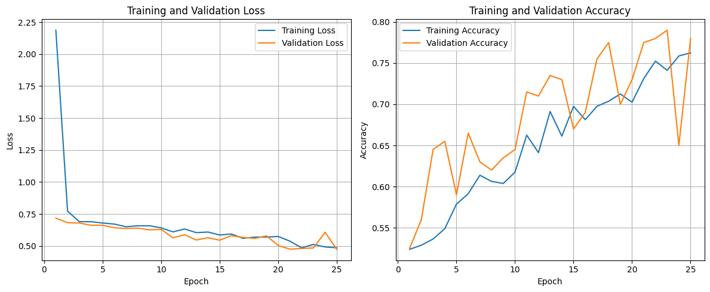

[← Back to Portfolio](../../README.md)

# 🐱🐶 Cat vs. Dog Image Classifier

A Convolutional Neural Network (CNN) built in PyTorch to classify 128×128 RGB images as either **cats** or **dogs**.  
This project explores model design, training challenges, overfitting/underfitting behaviors, and techniques used to stabilize and improve generalization.

---

## 📘 Project Overview

The model was trained using a dataset of ~1,000 images (balanced between cats and dogs). Images were preprocessed, augmented, and normalized before training. Early versions of the model experienced both **severe overfitting** and **mild underfitting**, which led to iterative improvements in the architecture and training pipeline.

This README summarizes the training process, challenges encountered, and insights learned.

---

## 📂 Dataset Summary

- **Total images:** ~1,000  
- **Classes:** 2 (Cat, Dog)  
- **Resolution:** Resized to 128×128  
- **Split:** 80% training, 20% validation  

### Data Augmentation Used

- Random horizontal flip  
- Random rotation (±10°)  
- Color jitter (brightness, contrast, saturation)  
- Normalization to mean/std of ImageNet-like RGB channels  

These transformations encouraged the model to learn class-level features rather than memorizing individual training images.

---

## 🧠 Model Architecture (Simplified)

- **3 Convolutional Blocks**
  - Conv → BatchNorm → ReLU → MaxPool  
  - Filters: 32 → 64 → 128
- **Fully Connected Layer (128 → 1)**
- **Dropout (0.5)** for regularization
- **Binary output** using BCEWithLogitsLoss

This architecture intentionally stays lightweight to avoid over-parameterization on a relatively small dataset.

---

## ⚠️ Training Challenges & Solutions

### 🟥 Overfitting (Early Attempts)

**Symptoms:**
- Training loss dropped rapidly  
- Validation loss stayed flat or rose  
- Validation accuracy lagged behind  

**Causes:**
- Model capacity too high relative to dataset size  
- Weak augmentation  
- No normalization or dropout  

**Fixes Implemented:**
- Added **BatchNorm** to each convolutional block  
- Added **Dropout** in the fully-connected layer  
- Strengthened augmentation pipeline  
- Reduced hidden layer sizes  

---

### 🟦 Underfitting (After Heavy Regularization)

After adding dropout and aggressive augmentation, the model struggled to extract enough signal.

**Symptoms:**
- Training & validation loss plateaued  
- Accuracy stalled around ~55–60%  

**Fixes:**
- Added a **third convolutional layer**  
- Increased network depth (32 → 64 → 128 filters)  
- Extended training duration (25 → 50 epochs)  
- Introduced a **learning rate scheduler** to refine late-stage training  

---

## 📈 Training Curves (After 25 Epochs)

This graph shows the **training and validation loss/accuracy** during a 25-epoch run.  
The model demonstrates clear improvements in stability, generalization, and overall class separation.

> **Note:** A *final* graph trained for **50 epochs** will be included later to further show minimized loss and smoother convergence.

### Interpretation

- **Loss steadily decreases** for both train and validation sets, indicating improved generalization.
- **Accuracy increases consistently**, with validation accuracy reaching **~78%** within 25 epochs.
- Minor fluctuations reflect normal dataset variability and augmentation noise.
- Extended training (50 epochs) is expected to further reduce loss and stabilize accuracy.

---

## 📊 Performance Summary (25 Epochs)

| Metric | Result |
|--------|--------|
| Training Accuracy | ~76% |
| Validation Accuracy | ~78% |
| Overfitting | Mild, controlled |
| Underfitting | Largely resolved |
| Generalization | Improved through BN + Dropout + Augmentation |

---

## 🚀 Planned Improvements

- Add final 50-epoch training plot  
- Experiment with transfer learning (ResNet-18, MobileNet, EfficientNet)  
- Increase dataset size  
- Add Gaussian noise / random crop augmentation  
- Try focal loss to reduce class-specific prediction difficulty  

---

## 🎉 Conclusion

This project highlights the full deep-learning workflow:
- designing a CNN  
- detecting overfitting & underfitting  
- improving the architecture  
- adding regularization  
- applying augmentation  
- tuning training behaviors with schedulers  

With only 25 epochs, the model already achieves strong, stable performance.  
The extended 50-epoch version will showcase further refinement and loss reduction.

---

[← Back to Portfolio](../../README.md)
