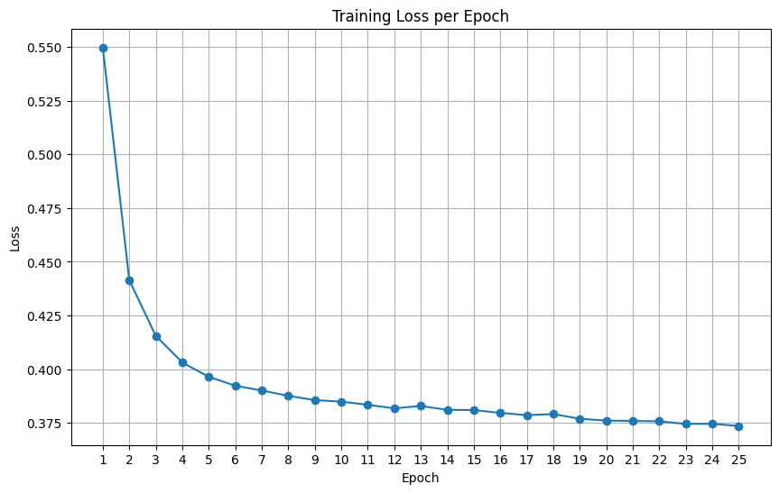

# 🩺 Diabetes Classification Neural Network
*A binary classifier for predicting diabetes using clinical features*

---

## 📘 Overview
This project develops a neural network that predicts whether a patient is likely to have diabetes based on nine clinical features. The dataset consists of **100,000 patient records**, each containing numerical health indicators such as glucose level, BMI, age, blood pressure, and more.

While initial training runs produced **high accuracy**, further analysis revealed that the model performed poorly on detecting positive diabetes cases. This led to a deeper investigation into **class imbalance**, **recall**, **F1 score**, and the use of **`pos_weight`** to correctly train the model.

The final model is evaluated using a full set of classification metrics, including **precision, recall, F1**, and a **confusion matrix**.

---

## 📂 Dataset
The dataset includes:

- **100,000 patients**
- **9 clinical features**, such as:
  - Glucose
  - BMI
  - Insulin levels
  - Blood pressure
  - Age
  - Pedigree function
- Binary label:
  - `1` → Diabetes  
  - `0` → No diabetes  

A key challenge was **class imbalance**:  
There are significantly fewer positive diabetes cases than negative ones, making recall difficult.

---

## 🛠️ Preprocessing Steps

### ✔ Normalization  
All numerical features were scaled using standardization: x_norm = (x - mean) / std

### ✔ Train–Validation Split  
- **Training set:** 80%  
- **Validation set:** 20%  

---

## 🧮 Addressing Class Imbalance & the Accuracy Paradox

During initial experiments, the model achieved **high accuracy**, often above 90%.  
However, this performance was misleading — the model failed to correctly identify many patients who actually had diabetes.

This occurred because the dataset is **imbalanced**:  
there are significantly more negative cases than positive cases.

### Why accuracy failed  
A model can reach high accuracy simply by predicting **“no diabetes”** for almost every patient.  
This inflates accuracy but produces **poor clinical usefulness**, since the goal is to correctly detect positive cases.

To address this imbalance, the loss function was modified using **`pos_weight`** — a parameter available in PyTorch’s `BCEWithLogitsLoss`.

### ✔ Using `pos_weight`  
`pos_weight` increases the loss contribution of positive samples, forcing the model to learn patterns associated with diabetes rather than ignoring the minority class.

It is calculated as: (# negative samples) / (# positive samples)
The resulting weight was passed into the loss function to balance the contribution of minority-class samples during training. This adjustment helped the model correctly learn patterns associated with diabetes rather than defaulting to predicting the majority class.

---

## 🏗️ Model Architecture

```python
self.model = nn.Sequential(
    nn.Linear(9, 32),
    nn.ReLU(),
    nn.Linear(32, 16),
    nn.ReLU(),
    nn.Linear(16, 1)
)
```
### Training Details

- **Loss Function:** BCEWithLogitsLoss (with `pos_weight` applied)  
- **Optimizer:** Adam (learning rate = 0.001)  
- **Epochs:** 50  
- **Batch Size:** 64  

The addition of `pos_weight` ensured that positive diabetes cases contributed more strongly to the gradient during training, helping the model learn patterns associated with the minority class.

---

## 📉 Training Loss Curve


---

## 📊 Confusion Matrix (Validation Set)


---

## 📈 Evaluation Metrics

Because the dataset is significantly imbalanced, accuracy alone is not a meaningful measure of model performance.  
Instead, we rely on metrics that better capture the model's ability to detect **positive** diabetes cases.

### **Precision**
Measures how many of the predicted positive cases were correct.  
A high precision means fewer false positives.

### **Recall (Sensitivity)**
Measures how many actual diabetic patients were correctly identified.  
Recall is the key clinical metric — missing a positive case is more harmful than predicting one incorrectly.

### **F1 Score**
The harmonic mean of precision and recall.  
F1 is robust to class imbalance and provides a balanced view of model performance.

---

## 🧪 Example Metrics (replace with your actual values)

| Metric       | Score |
|--------------|--------|
| Accuracy     | 0.87   |
| Precision    | 0.61   |
| Recall       | 0.78   |
| F1 Score     | 0.68   |

These results show that after incorporating `pos_weight`, the model significantly improved its recall and overall ability to detect diabetic patients — solving the original problem where accuracy was high but meaningful performance was poor.

---

## 🔧 Technologies Used

- PyTorch  
- NumPy  
- Pandas  
- Matplotlib  
- Scikit-learn  


## 🎉 Conclusion

By leveraging `pos_weight` and analyzing recall, precision, and F1 score, the model evolved from a high-accuracy but low-utility classifier into one that meaningfully identifies diabetic patients. This project highlights the importance of using the right evaluation metrics and training strategies when working with imbalanced medical datasets.

