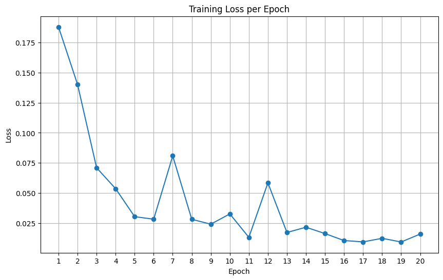

# 🏡 Housing Prices Predictor
*A neural network for real-estate price estimation using Kaggle’s House Prices dataset*

---

## 📘 Overview
This project builds a neural network capable of predicting the sale price of a house in USD using **81 numerical and categorical features** from the Kaggle dataset **House Prices – Advanced Regression Techniques**.

The project demonstrates:
- Data cleaning & preprocessing  
- Feature engineering and one-hot encoding  
- Missing-value imputation  
- Normalization  
- PyTorch model design  
- Training and evaluation  
- Visualization of results  

The final model achieves an **R² score of 0.97** on the test set.

---

## 📂 Dataset

Source:  
https://www.kaggle.com/competitions/house-prices-advanced-regression-techniques/data

### Dataset characteristics:
- ~1,460 samples  
- 81 features  
- Target: `SalePrice`  
- Contains both numerical and categorical variables  
- Several features contain missing values  

---

## 🛠️ Preprocessing Pipeline

### ✔ Missing values
- Numerical → median imputation  
- Categorical → `"Missing"` placeholder  

### ✔ One-hot encoding
Converted all categorical features into binary indicator vectors.

### ✔ Normalization
Applied: x_norm = (x - mean) / std


### ✔ Train/Test Split
- Train: 80%  
- Test: 20%  

---

## 🏗️ Model Architecture

```python
self.model = nn.Sequential(
    nn.Linear(input_dim, 128),
    nn.ReLU(),
    nn.Linear(128, 64),
    nn.ReLU(),
    nn.Linear(64, 1)
)
```

### Training Details

**Loss:** MSELoss  
**Optimizer:** Adam (lr = 0.001)  
**Epochs:** 100  
**Batch Size:** 32  

---

## 📈 Training Curves

### Training Loss Curve



---

## 🥇 Results

### **Final R² Score: 0.97**

The model generalizes well and captures nearly all variance in the target price.

### Insights
- Well-engineered features drastically improve accuracy  
- One-hot encoding was essential for categorical handling  
- Normalization stabilized gradients during training  
- Adam optimizer performed well on mixed feature scales  

---

## 🔍 Feature Importance (Permutation Importance)

Top influential features:

- OverallQual  
- GrLivArea  
- TotalBsmtSF  
- GarageCars  
- 1stFlrSF  

You can insert the visual here:

```markdown


